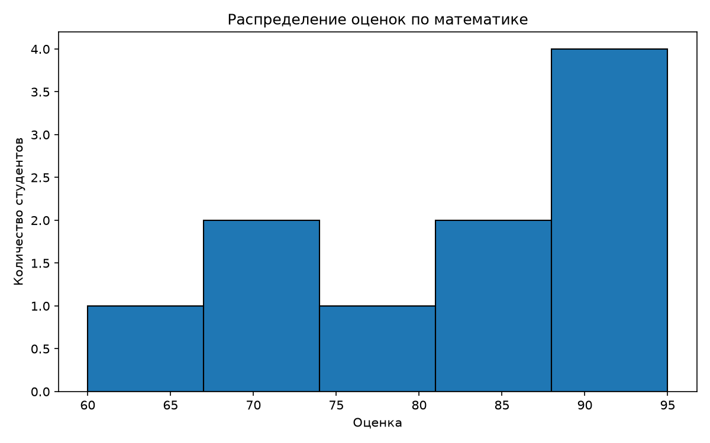
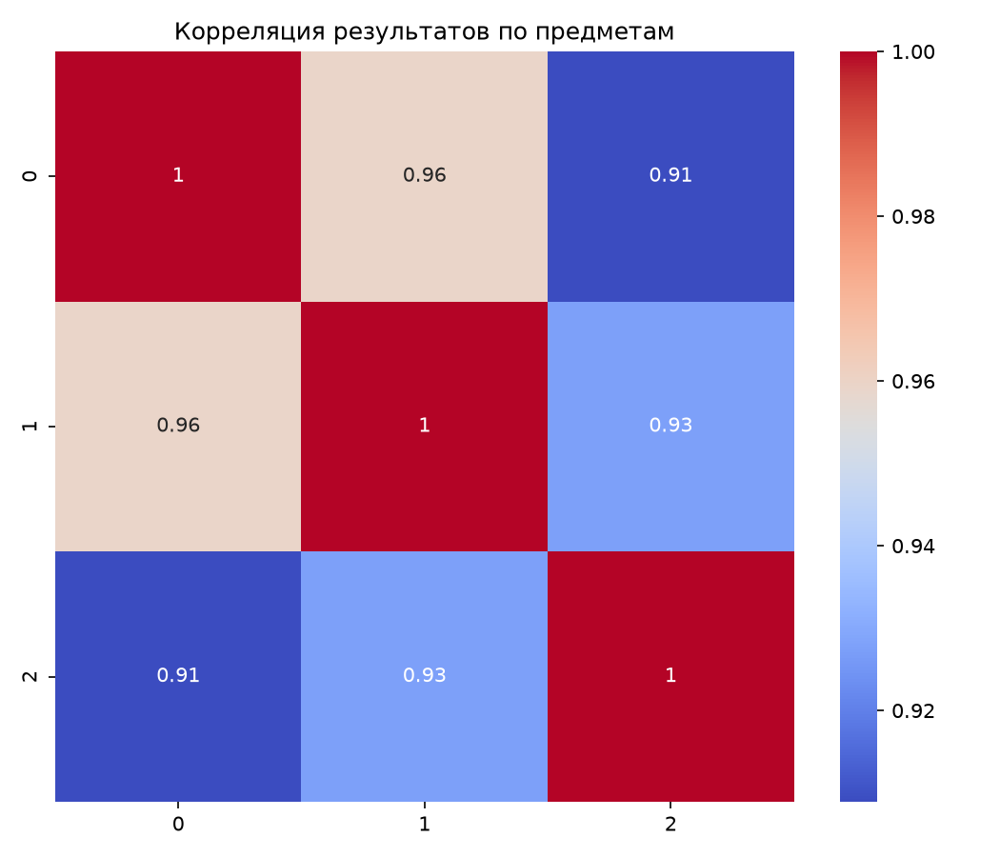
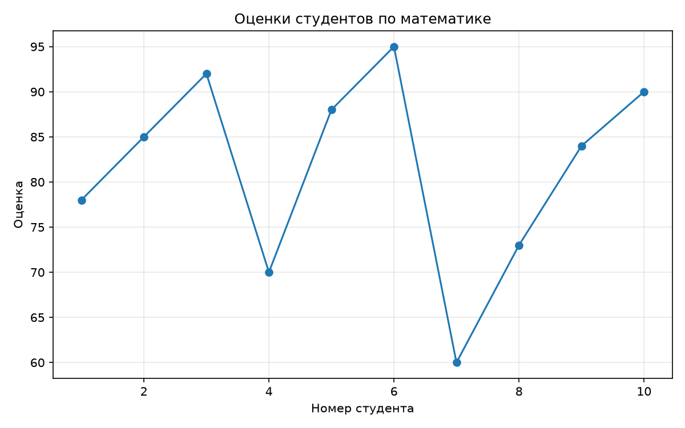

# Лабораторная работа №2

## Основы NumPy: массивы и векторные операции

## Цель работы

Познакомиться с библиотекой NumPy и научиться выполнять операции над массивами без использования обычных циклов Python. Дополнительно требовалось провести статистический анализ данных из CSV-файла и построить несколько графиков.

## Задание

В рамках лабораторной работы требовалось:

1. Создавать и преобразовывать массивы NumPy.
2. Выполнять векторные операции.
3. Работать с матрицами и системами линейных уравнений.
4. Загружать данные из CSV-файла.
5. Рассчитывать основные статистические показатели.
6. Выполнять Min-Max-нормализацию.
7. Строить и сохранять графики.
8. Добавить аннотации типов и документацию.
9. Проверить решение автоматическими тестами.

## Использованные библиотеки

В работе использовались:

- `NumPy` — массивы, вычисления, статистика и линейная алгебра;
- `pandas` — загрузка CSV-файла;
- `Matplotlib` — гистограмма и линейный график;
- `Seaborn` — тепловая карта;
- `pytest` — автоматическое тестирование.

## Ход работы

### Работа с массивами

Вектор от 0 до 9 создаётся функцией `numpy.arange`. Для изменения формы массива используется метод `reshape`, а для транспонирования — свойство `T`.

Все арифметические операции выполняются непосредственно над массивами NumPy. Благодаря векторизации для сложения и умножения элементов не потребовались циклы Python.

### Матричные операции

Матричное умножение выполняется оператором `@`.

Для задач линейной алгебры использовался модуль `numpy.linalg`:

- `numpy.linalg.det` — вычисление определителя;
- `numpy.linalg.inv` — получение обратной матрицы;
- `numpy.linalg.solve` — решение системы `Ax = b`.

### Статистический анализ

Данные загружаются из CSV-файла через `pandas.read_csv`, после чего преобразуются в массив NumPy.

Для оценок по математике были рассчитаны:

| Показатель | Значение |
|---|---:|
| Среднее | 81.5 |
| Медиана | 84.5 |
| Стандартное отклонение | 10.5095 |
| Минимум | 60 |
| Максимум | 95 |
| 25-й перцентиль | 74.25 |
| 75-й перцентиль | 89.5 |

### Нормализация

Для приведения значений к диапазону от 0 до 1 использовалась формула:

```text
(x - min) / (max - min)
```

Если все элементы массива одинаковые, разность между максимумом и минимумом равна нулю. В этом случае функция возвращает массив из нулей, чтобы избежать деления на ноль.

## Визуализация

### Распределение оценок по математике



Гистограмма показывает распределение оценок по математике среди студентов.

### Корреляция результатов



Тепловая карта позволяет увидеть связь между результатами по математике, физике и информатике.

### Оценки студентов



Линейный график показывает изменение оценки по математике для каждого студента.

## Тестирование

Для проверки функций использовался `pytest`.

Исходный файл содержал 17 тестов. Дополнительно был добавлен тест функции транспонирования матрицы, так как в исходном наборе она не проверялась.

Результат:

```text
18 passed
```

Все функции прошли проверку.

## Нюансы решения

- Векторные операции выполняются без циклов.
- `numpy.std` по умолчанию вычисляет стандартное отклонение для всей совокупности с параметром `ddof=0`.
- Сравнивать результаты вычислений с плавающей точкой лучше через `numpy.allclose`.
- Обратная матрица существует только для невырожденной квадратной матрицы.
- `numpy.linalg.solve` требует согласованных размеров матрицы коэффициентов и вектора правой части.
- После сохранения каждого графика фигура закрывается, чтобы при повторных тестах не накапливались открытые графики.
- Каталог `plots` создаётся автоматически.

## Исходный код

[Скачать файл с реализацией и тестами](main.py)

## Вывод

В ходе лабораторной работы я разобрался с созданием и преобразованием массивов NumPy, векторными и матричными операциями, статистическим анализом и нормализацией данных. Также научился загружать данные из CSV, строить графики и проверять функции автоматическими тестами.