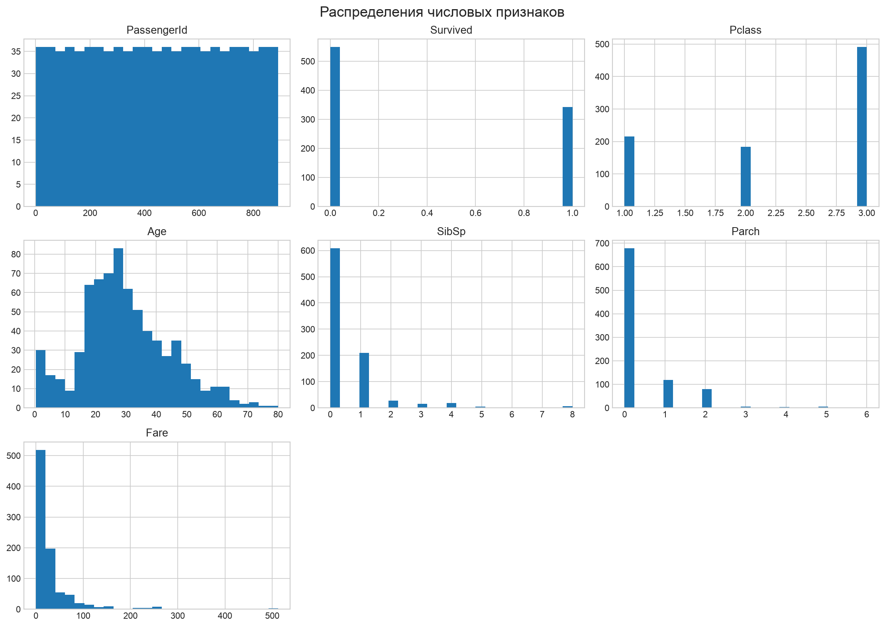
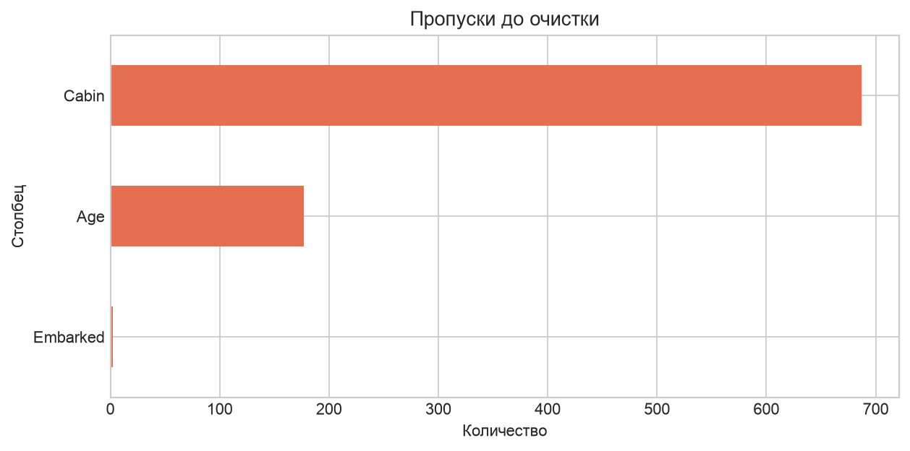
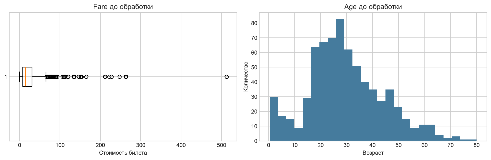
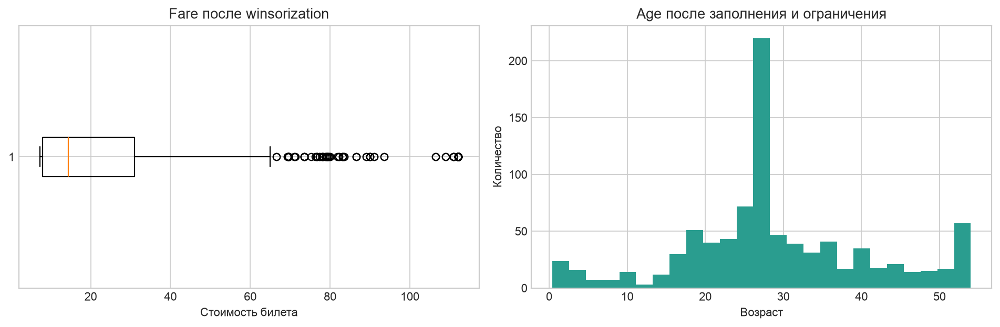
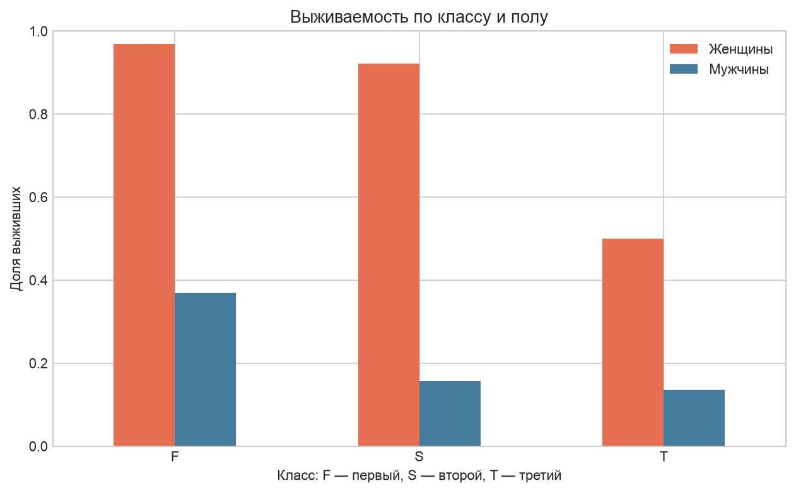
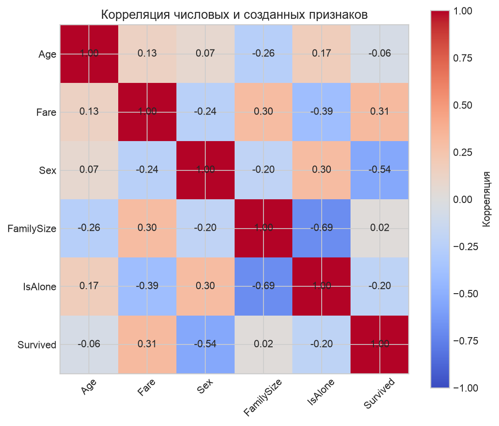

# Лабораторная работа №6

## Очистка и трансформация данных. pandas

**Выполнил:** Корнеев Фёдор, группа P3120

## Ноутбук и данные

[Открыть выполненную лабораторную в Google Colab](https://colab.research.google.com/github/infinitrator/infinitrator.github.io/blob/main/lab6/LR-6-pandas-cleaning.ipynb)

[Посмотреть файл `.ipynb` в репозитории](https://github.com/infinitrator/infinitrator.github.io/blob/main/lab6/LR-6-pandas-cleaning.ipynb)

[Скачать очищенный CSV](https://github.com/infinitrator/infinitrator.github.io/raw/refs/heads/main/lab6/titanic_cleaned.csv)

Ноутбук сохранён с результатами выполнения всех ячеек. Исходный CSV загружается
автоматически, поэтому борд одинаково запускается локально и в Google Colab.

## 1. Введение

Перед анализом реальные данные нужно проверить: найти пропуски, привести типы,
обработать экстремальные значения и создать удобные признаки. В этой работе все
этапы выполнены с помощью `pandas` на данных пассажиров «Титаника».

## 2. Цель работы

Освоить первичный анализ, очистку и трансформацию данных, агрегацию,
визуализацию и вычисление метрик качества предобработки.

## 3. Описание набора данных

Использован набор Titanic из соревнования Kaggle. Он содержит **891 строку и 12
исходных столбцов**. Одна строка соответствует пассажиру. `Survived` показывает,
выжил ли пассажир, а остальные поля описывают класс билета, имя, пол, возраст,
семью, билет, стоимость, каюту и порт посадки.

## 4. Первичный анализ

Были выведены первые десять строк, размер таблицы, типы всех признаков и число
заполненных значений. Исходные числовые признаки имели типы `int64` и `float64`,
а текстовые — `str`.

Найдены пропуски:

| Столбец | Пропусков | Доля от 891 строк |
|---|---:|---:|
| Cabin | 687 | 77,10% |
| Age | 177 | 19,87% |
| Embarked | 2 | 0,22% |

Всего в исходной таблице было **866 пропущенных значений**.

## 5. Статистика датафрейма

Средний возраст пассажира до заполнения пропусков — **29,70 года**, медианный —
**28 лет**. Средняя стоимость билета равна **32,20**, медианная — **14,45**, а
максимальная — **512,33**. Большая разница между средним, медианой и максимумом
`Fare` указывает на правостороннюю асимметрию и экстремальные значения.

## 6. Визуализация пропусков

Основная проблема — `Cabin`: восстановить 687 точных номеров кают без внешней
информации невозможно. Поэтому из этого столбца был извлечён более общий признак
палубы.

## 7. Обработка пропусков

- `Age` заполнен медианой 28 лет;
- `Embarked` заполнен модой `S`;
- из первой буквы `Cabin` создан признак `Deck`;
- неизвестная палуба получила значение `U`;
- исходный почти пустой столбец `Cabin` удалён.

## 8. Методы заполнения

Для возраста выбрана медиана, потому что она слабее зависит от выбросов, чем
среднее. Для порта подходит мода, так как это категориальный признак и пропущены
только две строки. Для каюты использовано извлечение доступной информации вместо
попытки угадать точный номер.

## 9. Результаты обработки

После заполнения и преобразования осталось **0 пропусков**. Возрастные группы
распределились так:

| Группа | Количество |
|---|---:|
| Child | 69 |
| Teen | 70 |
| Young adult | 535 |
| Adult | 195 |
| Senior | 22 |

Для 687 пассажиров палуба неизвестна. Среди известных чаще всего встречаются
палубы C — 59 человек, B — 47 и D — 33.

## 10. Трансформация данных

`Pclass` преобразован в строковую категорию по условию задания: первый класс —
`F`, второй — `S`, третий — `T`. Пол закодирован числами: женщина — `0`, мужчина
— `1`. `Embarked`, `Age_group`, `Deck`, `Title` и `Pclass` приведены к типу
`category`.

## 11. Созданные признаки

- `Age_group` — возрастная группа;
- `Deck` — первая буква каюты или `U`;
- `Title` — обращение, извлечённое из имени;
- `FamilySize = SibSp + Parch + 1`;
- `IsAlone` — 1, если пассажир путешествовал без семьи.

Получено 517 пассажиров с обращением `Mr`, 182 — `Miss`, 125 — `Mrs`, 40 —
`Master`, редкие обращения объединены в `Rare` (27 строк). Без семьи на борту
находились **537 пассажиров**.

## 12. Преобразования типов

`Sex` преобразован в `int8`, `IsAlone` также хранится как бинарное число.
Категориальный тип уменьшает двусмысленность признаков и явно фиксирует набор
допустимых категорий.

## 13. Обработка выбросов

До обработки `Fare` имеет длинный правый хвост, а возраст содержит небольшое
число очень больших значений.

## 14. Выявленные выбросы

Для `Fare` получены:

- Q1 = **7,9104**;
- Q3 = **31,0000**;
- IQR = **23,0896**;
- нижняя граница = **−26,7240**;
- верхняя граница = **65,6344**.

По правилу 1,5 × IQR найдено **116 выбросов** стоимости билета.

## 15. Методы обработки

Для `Fare` применена winsorization: значения ограничены 5-м и 95-м
перцентилями, то есть диапазоном **7,2250–112,0791**. Наблюдения не удалялись,
поэтому размер выборки сохранился. Возраст ограничен сверху 95-м перцентилем —
**54 года**; заменены 42 экстремальных значения.

## 16. Агрегация и анализ

Средняя выживаемость по классам:

| Класс | Доля выживших |
|---|---:|
| F — первый | 0,6296 |
| S — второй | 0,4728 |
| T — третий | 0,2424 |

Медианный возраст во всех трёх портах после заполнения равен 28 годам. При
совместной группировке по классу и полу самая высокая выживаемость получена у
женщин первого класса — **96,81%**, самая низкая — у мужчин третьего класса —
**13,54%**.

## 17. Сводные статистики

Создана сводная таблица средней выживаемости по классу, возрастной группе и
полу. Например, среди молодых взрослых первого класса выжили 97,8% женщин и
39,2% мужчин. В третьем классе для той же возрастной группы значения составили
54,7% и 13,3%.

## 18. Визуализации

График показывает одновременно два сильных различия: выживаемость женщин выше
выживаемости мужчин во всех классах, а первый класс имеет преимущество перед
третьим.

## 19. Метрики качества очистки

| Метрика | До | После |
|---|---:|---:|
| Количество пропусков | 866 | 0 |
| Полнота данных | 91,90% | 100,00% |
| Обработано исходных пропусков | — | 100,00% |

Число уникальных категорий: `Pclass` — 3, `Embarked` — 3, `Age_group` — 5,
`Deck` — 9, `Title` — 5. После преобразования 64,76% записей относятся к
мужчинам, 60,27% пассажиров путешествовали одни, доля выживших равна 38,38%.

С выживанием сильнее всего связан пол (`−0,543` при кодировании мужчина = 1),
затем стоимость билета (`0,313`) и одиночное путешествие (`−0,203`). Между
`FamilySize` и `IsAlone` ожидаемо получена сильная отрицательная корреляция
`−0,691`.

## 20. Результаты работы

Получена очищенная таблица размером **891 × 16**. Она содержит исходные полезные
поля и пять новых признаков, не имеет пропусков и сохранена в
`titanic_cleaned.csv`. В ноутбуке находятся код, таблицы и все построенные
графики.

## 21. Выводы

В работе выполнен полный цикл предобработки Titanic: первичный анализ,
визуализация пропусков, обоснованное заполнение, преобразование типов, создание
признаков, поиск и ограничение выбросов, агрегация и оценка результата. Все 866
пропусков обработаны без удаления строк. Анализ показал, что выживаемость была
выше у женщин и пассажиров более высокого класса. Подготовленный CSV можно
использовать для дальнейшего анализа и обучения моделей.
